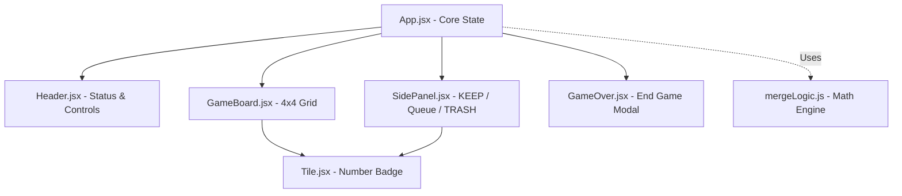

# Just Divide — React Puzzle Game

A beautiful, responsive, and mathematically engaging puzzle game built using **ReactJS** and **Vanilla CSS**. 

## 🎮 How to Play

The game is played on a **4×4 grid**. Your objective is to place numbered tiles onto the grid to perform division-based merges, clear the board, and maximize your score before the grid fills up.

1. **Place Tiles**: Drag tiles from the upcoming queue (or the **KEEP** slot) and drop them on any empty slot in the grid.
2. **Equal Tiles Rule**: If you place a tile adjacent to a tile of the same value, both tiles will merge and vanish.
   * *Score earned:* Value of tile × 2.
3. **Divisible Tiles Rule**: If two adjacent tiles are divisible (the larger number divided by the smaller number leaves a remainder of 0), the larger number is divided by the smaller number, and the smaller number vanishes.
   * *Score earned:* Smaller tile value × 2.
4. **Clean "1" Bonus**: If a division results in the value `1`, that tile is automatically cleared from the grid.
   * *Score earned:* +5 bonus points.
5. **Chain Reactions**: Merges trigger chain reactions. If a cell value changes, the game automatically checks its neighbors recursively until no further merges can be made.
7. **TRASH Slot**: Discard unwanted tiles from the queue or KEEP slot. Trash uses are limited and constant for each game (depending on difficulty), so use them wisely!
8. **Leveling**: Every 10 points advances you to a new level, resetting or expanding your tile generation pool.

---

## ⌨️ Controls & Shortcuts

Interact using your mouse (desktop), touch gestures (mobile/tablet), or the following keyboard shortcuts:
* **`Z`** → Undo last move (stores up to 10 moves).
* **`R`** → Restart the game.
* **`G`** → Toggle Hints (glows empty cells that will trigger an immediate merge).
* **`1`** → Set difficulty to **Easy** (starting level 1, 10 trash slots).
* **`2`** → Set difficulty to **Medium** (starting level 2, 6 trash slots).
* **`3`** → Set difficulty to **Hard** (starting level 3, 3 trash slots).

---

## 🏗️ Architecture & Component Design

The application is structured into modular, reusable components with unidirectional state flow:

### Component Breakdown
* **`App.jsx`**: Manages all game states (grid, queue, keep slot, score, level, trash, timers, and active touch drag coordinates). It orchestrates touch events and keydown shortcuts.
* **`Header.jsx`**: Renders badges (Level & Score) and the controls panel (restart, hints, undo, difficulty selector, and how-to-play helper modal).
* **`GameBoard.jsx`**: Renders the 4×4 grid and handles drag/drop hover states.
* **`SidePanel.jsx`**: Renders the gold utility panel consisting of the Keep slot, 3-tile queue, and Trash slot.
* **`Tile.jsx`**: Generates the badge image and typography based on the tile value.
* **`GameOver.jsx`**: Displayed on a full-screen blurred backdrop when all 16 grid cells are occupied.
* **`mergeLogic.js`**: Pure math module. Implements BFS-based chain reaction propagation, level pool generation, and hint highlighting calculation.

---

## 💡 Key Design Decisions & Challenges

### 📱 1. Custom Mobile Touch Drag & Drop (No External Libraries)
**Challenge:** Standard HTML5 Drag and Drop events (`onDragStart`, `onDragOver`, `onDrop`) are not supported by mobile browsers (iOS Safari, Android Chrome).
**Solution:** Built a lightweight, high-performance touch dragging overlay directly using native touch events (`onTouchStart`, `onTouchMove`, `onTouchEnd`). 
* When a touch starts on a draggable tile, it captures the tile's data and tracks the finger coords.
* A floating clone of the tile is rendered at the touch position using `position: fixed` and `pointer-events: none`.
* In real time, the code queries the element directly under the finger using `document.elementFromPoint(x, y)` and searches for the closest `[data-drop-target]` to add drop previews.
* On touch release, it applies the drop action to the highlighted target.
* This approach achieves native-feeling drag performance on mobile devices with zero bundle-size overhead.

### 🧠 2. Hint System Calculation
**Challenge:** Finding cells that can trigger valid division or equality merges efficiently without performance drops.
**Solution:** Created a quick scan algorithm in `mergeLogic.js` (`getHintCells`) that checks each empty cell, queries its adjacent cardinal neighbors, and verifies whether the current queue/keep tile value triggers any equal/divisible math rules with them. It updates instantly as the active tile switches or moves.

### 🎨 3. Responsive Web Layout & Design Tuning
**Challenge:** Creating a layout that feels compact on phone viewports but looks premium and occupies the screen beautifully at standard desktop layouts (e.g. 1440×1024).
**Solution:**
* Hand-crafted CSS layout using CSS Custom Properties (`--cell-size`, `--grid-gap`).
* Optimized cell scaling: `@media` breakpoints dynamically scale cells from `68px` on mobile, to `80px` on small laptops, `90px` on standard desktops, and `96px` at `1440px` and larger screens.
* Incorporated premium visual elements including backdrop-blur overlays, gradient borders, scaling animations, hover wiggles, and high-fidelity asset rendering.

---

## 🚀 Future Improvements
1. **Interactive Audio**: Adding custom sound clips for cell drops, successful merges, level ups, and game-over states to increase player immersion.
2. **Merge Animations**: Adding visual slide lines showing the movement of a smaller tile as it merges into a larger tile.
3. **Global Leaderboard**: Integrating a firebase-backed database to store and display the top best scores globally.
